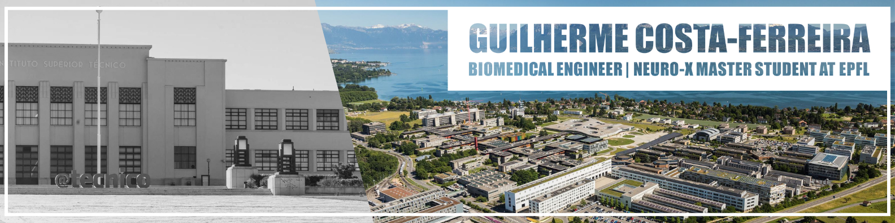
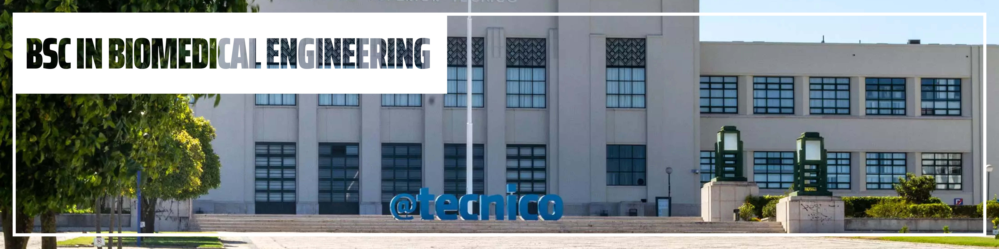

# Portfolio

I present all the relevant projects, posters, and reports I have done during my academic path (BSc in Biomedical Engineering and MSc in Neuro-X) and personal life. Most of the presented work will have a link to their specific repository.

## Listing of Projects

- [BSc Biomedical Engineering](#bsc-biomedical-engineering)
  - [PIC Project: Analysis and Correlation of Brain Motor Information in the Context of BMIs](#pic-project-analysis-and-correlation-of-brain-motor-information-in-the-context-of-bmis)
  - [Optimizing Pipeline for 3D Reconstruction of Protein Aggregates](#optimizing-pipeline-for-3d-reconstruction-of-protein-aggregates)
  - [Digital Interface for Upper Limb Amputees](#digital-interface-for-upper-limb-amputees)
- [MSc Neuro-X](#msc-neuro-x)
  - [Using Machine Learning Algorithms to Analyse Interview Content of Out-of-Body Experiences](#using-machine-learning-algorithms-to-analyse-interview-content-of-out-of-body-experiences)
  - [NeuroFrame: A Stereotaxic Brain Atlas for a Novel Mouse Model of Parkinson’s Disease](#neuroframe-a-stereotaxic-brain-atlas-for-a-novel-mouse-model-of-parkinsons-disease)
  - [Arm Stump 3D Scanning](#arm-stump-3d-scanning)
- [Personal](#personal)
  - [AgoraSim: Society Simulator](#agorasim-society-simulator)

     

## BSc Biomedical Engineering

In the following section, I present all the relevant work I did during my Bachelor's in Biomedical Engineering at the Instituto Superior Técnico in Lisbon. These include:

- [PIC Project: Analysis and Correlation of Brain Motor Information in the Context of BMIs](#pic-project-analysis-and-correlation-of-brain-motor-information-in-the-context-of-bmis)
- [Optimizing Pipeline for 3D Reconstruction of Protein Aggregates](#optimizing-pipeline-for-3d-reconstruction-of-protein-aggregates)
- [Digital Interface for Upper Limb Amputees](#digital-interface-for-upper-limb-amputees)

---

### PIC Project: Analysis and Correlation of Brain Motor Information in the Context of BMIs

This section provides insight into my final bachelor project (PIC Project). It was a joint work between IST and the Champalimaud Foundation. Here, we analysed how we can use machine learning algorithms to decode arm movement from neuron activity (action potentials). For it, we used the dataset from the [Neural Latents Benchmark](https://neurallatents.github.io/datasets): MC Maze.

#### Abstract

Using Brain-Machine Interfaces (BMI) to solve health problems related to the nervous system has proven a promising approach. With innovative studies that allow motor rehabilitation to companies developing and commercialising devices that grant seamless computer integration, the future solution to these problems lies with BMIs. We developed and applied two models: (a) Population vector and (2) Naïve Bayes to decode from 182 motor neurons’ hand movement from the MC Maze dataset. After optimisation, we obtained 0.24 and 0.45 in R2 correlation, respectively. They were able to shed light on many characteristics of the motor cortex, such as the tuning of the neurons and the increased amount of information they code. This information granted the possibility of improvement and adaptations of our models. However, we did not obtain correlations closer to other models applied to this dataset, as our decoders lacked developed preprocessing steps. Nonetheless, this project works as an introduction to the BMI problem. 

#### Acknowledgments

This project could not have been completed without the help of Dr Memming Park and Carolina Filipe (Champalimaud Research, Champalimaud Foundation, Portugal) and Dr Athanasios Vourvopoulos (Institute for Systems and Robotics/LaSEEB). 

#### Links and Extras

> Final Grade: 19/20   > [Project Repository Link](https://github.com/GuilhermeCosta-Ferreira/PIC-Motor-Cortex-and-BMIs)   > [Project Report File](./BSc%20Biomedical%20Engineering/Analysis%20and%20Correlation%20of%20Brain%20Motor%20Information%20in%20the%20Context%20of%20BMIs.pdf)

---

### Optimizing Pipeline for 3D Reconstruction of Protein Aggregates

In the [Principles of Biosignals and Biomedical Imaging](https://fenix.tecnico.ulisboa.pt/cursos/lebiom21/disciplina-curricular/845953938490063) class, with the help of João Freitas and Catarina Gonçalves, we built a new pipeline to improve on 3D protein aggregates reconstruction in Matlab. After the filtering step, we combined our Density Ascent Algorithm, the Otsu Method and Erosion and Dilation into (what we called) the Search2Segment Algorithm. We also analysed how to optimise the pipeline and proved its efficacy.

#### Abstract

Throughout different realities of the medical domain, it’s essential to study cellular structures due to the mechanism’s complexity and the biological processes. To do so, microscope observations are critical, and one of the most popular methods of structure elucidation in cell physiology is fluorescence microscopy. Given 28 histological slices from one cell containing two protein aggregates obtained by this technique, we applied fundamental steps from imaging processing. Moreover, this project has the purpose of reaching into a 3D reconstruction of the protein aggregates, which underlie the pathogenesis of neurodegenerative disorders, as well as computing the volume of these structures. Starting by removing characteristic noise from each slice through the Gaussian filter (after choosing it, compared to the median filter), we proceed to the segmentation and binarization phase, using the Search2Segment algorithm, a method developed by our group, which integrates the well-established Otsu method. During each stage, different parameters were tested and compared, aiming to preserve edges that shape aggregate form. With the masks applied, we assembled and aligned them to reconstruct the protein aggregates and calculate their volume. Based on a voxel dimension, we got to the total volume equal to 170.40 μm3. 

#### Contacts

João Freitas: joao.ferreira.de.freitas@tecnico.ulisboa.pt  
Catarina Gonçalves: catarinamarquesgoncalves@tecnico.ulisboa.pt

#### Links and Extras

> Project Final Grade: 19.35/20   > [Project Repository Link](https://github.com/GuilhermeCosta-Ferreira/3DReconstruction)   > [Project Report File](./BSc%20Biomedical%20Engineering/Optimizing%20Pipeline%20for%203D%20Reconstruction%20of%20Protein%20Aggregates.pdf)

---

### Digital Interface for Upper Limb Amputees

In the [Principles of Bioinstrumentation](https://fenix.tecnico.ulisboa.pt/cursos/lebiom21/disciplina-curricular/845953938490061) course, with the help of João Freitas and António Figueira, we developed an accelerometer-based digital interface for upper limb amputees. With this proof of concept, we aimed to improve the connection of these patients to the everyday computer, allowing them to sweeten their workflow and hopefully establish new ways to reconnect with the work environment.

The report was originally written in Portuguese. However, a translated version can also be found [here](./BSc%20Biomedical%20Engineering/Digital%20Interface%20for%20Upper%20Limb%20Amputees.pdf).

#### Contacts

João Freitas: joao.ferreira.de.freitas@tecnico.ulisboa.pt  
António Figueira: antoniofigueira7@tecnico.ulisboa.pt

#### Links and Extras

> Course Final Grade: 19/20   > [Project Repository Link](https://github.com/GuilhermeCosta-Ferreira/Amputee-Mouse-Control)   > [Translated Report File](./BSc%20Biomedical%20Engineering/Digital%20Interface%20for%20Upper%20Limb%20Amputees.pdf)   > [Original Report File](./BSc%20Biomedical%20Engineering/Interface%20Digital%20Para%20Amputados%20Dos%20Membros%20Superiores.pdf)

     

## MSc Neuro-X

In the following section, I present all the relevant work I did during my Master's in Neuro-X at EPFL in Lausanne. These include:

- [Using Machine Learning Algorithms to Analyse Interview Content of Out-of-Body Experiences](#using-machine-learning-algorithms-to-analyse-interview-content-of-out-of-body-experiences)
- [NeuroFrame: A Stereotaxic Brain Atlas for a Novel Mouse Model of Parkinson’s Disease](#neuroframe-a-stereotaxic-brain-atlas-for-a-novel-mouse-model-of-parkinsons-disease)
- [Arm Stump 3D Scanning](#arm-stump-3d-scanning)

---

### Using Machine Learning Algorithms to Analyse Interview Content of Out-of-Body Experiences

In the [Machine Learning](https://www.epfl.ch/labs/mlo/machine-learning-cs-433/) course, with the help of Rodrigo Anjos and Mehdi Amor, we developed a pipeline to objectively analyse the content of interviews in research settings enabling to draw new conclusions from this type of content. To do so, we implemented VADER-based analysis and BERT and Top2Vec Models analysis.

#### Abstract

Machine Learning models can also be leveraged as analytical tools, providing insights into how some set-up works. By applying these algorithms to study the valency (VADER), emotion (BERT) and topic (Top2Vec) content in interviews for Out-of-Body research done by the LNCO Lab at EPFL, we were able to validate the usefulness of our pipeline. We delved into group analysis to find differences between the experiments realised. We discovered that OBE1 and OBE2 interventions had a higher presence of surprise as the dominant emotion and joy appeared less frequently than for the control condition. When applying the intervention to OBE1 and OBE2 participants, meditation and feeling topics are more common, while for Compassion experiments, meditation and feeling are more frequent in control than in intervention. By applying an individual analysis, we verified the presence of interviewer bias and found that it affects the participant's response. Surprisingly, it is also influenced by the participant's interactions, proving a bidirectional trade of sway. 

#### Aknowedgments

This project was developed in collaboration with LNCO Lab in the ML4Science and could not have been completed without the help of:  
Dr. Bruno Herbelin: bruno.herbelin@epfl.ch  
David Friou: david.friou@epfl.ch

#### Links and Extras

> Project Grade: B  > [Project Report File](./MSc%20Neuro-X/Using%20Machine%20Learning%20Algorithms%20to%20Analyse%20Interview%20Content%20of%20Out-of-Body%20Experiences.pdf)

---

### NeuroFrame: A Stereotaxic Brain Atlas for a Novel Mouse Model of Parkinson’s Disease

For my first semester project, I joined [NeuroRestore](https://www.neurorestore.swiss/) to build a stereotaxic atlas for a new mouse model of Parkinson's disease. In this project I used 11 mice's MRIs, μCTs, and segmentations to obtain precise brain region coordinates to aid in stereotaxic surgery. The pipeline is fully automatic and provides a quick and effective tool to build more specific brain atlases. The results can all be quickly accessed through the website I also built [here.](https://neuroframe.ch/)

#### Abstract

 Waiting for Submission 

#### Aknowedgments

This project was developed at .NeuroRestore and supervised by Dr. Antoine Philippides (antoine.philippides@epfl.ch)

#### Links and Extras

> Project Grade: 6/6  > [Website](https://neuroframe.ch/)  > [Public Project](https://github.com/NR-NeuroFrame)

---

### Arm Stump 3D Scanning

For my third semester at EPFL, I joined the MAKE Project N-Pulse, where I am the team leader of haptics and scanning. Here, I developed a 3D scanning protocol for accurate reconstruction of the stump of the amputee to best improve prosthesis comfort. In this project I applied what I had learned during the Computer Vision course, like projection coordinates and convex hull extraction. The project included both algorithm construction and structure construction.

#### Links and Extras

> [Public Project](https://github.com/N-Pulse/ARM-SOFT-Scanning)

---

     

## Personal

Here you will find the projects and reports I completed in my personal time.

- [AgoraSim: Society Simulator](#agorasim-society-simulator)

---

### AgoraSim: Society Simulator

**AgoraSim**, inspired by the Greek Agora, the public space for democratic discussion, and Simulation, is an open-source platform with two core goals:

- 🤖 Develop simulation tools
- 🇵🇹 Generate concrete, evidence-based solutions for the Portuguese context

With this side project I aim to learn how to build simulating software with Python and, at the same time, shed some light on the feasibility and impact of some public policies. Due to the nature of the project, the first objective is to have just a basic and functional simulation and build from the ground up in complexity. Once it reaches a good level of complexity, it would be interesting to study how it predicts the Portuguese economic metrics, institutional dynamics, and policy impacts.

#### Links and Extras

> [Public Project](https://github.com/Agora-Sim)
